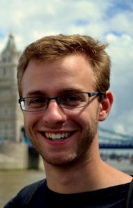
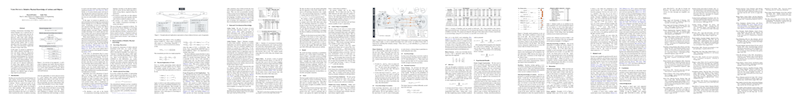

# about

The **Verb Physics** project explores how our choice of verbs tells us about the
physical properties of the objects that we talk about.

> Mary threw _____.

_Whatever Mary threw (a ball? a rock?) is probably smaller and weighs less than
her_

> Ricardo walked into _____.

_Whatever Ricardo walked into (the library? his office?) is probably larger
than him_

# demo

Coming soon — Max, 7/13/17

# abstract

Learning commonsense knowledge from natural language text is nontrivial due to
reporting bias: people rarely state the obvious, e.g., "My house is bigger than
me." However, while rarely stated explicitly, this trivial everyday knowledge
does influence the way people talk about the world, which provides indirect
clues to reason about the world. For example, a statement like, "Tyler entered
his house" implies that his house is bigger than Tyler.

In this paper, we present an approach to infer relative physical knowledge of
actions and objects along five dimensions (e.g., size, weight, and strength)
from unstructured natural language text. We frame knowledge acquisition as joint
inference over two closely related problems: learning (1) relative physical
knowledge of object pairs and (2) physical implications of actions when applied
to those object pairs. Empirical results demonstrate that it is possible to
extract knowledge of actions and objects from language and that joint inference
over different types of knowledge improves performance.

# authors

<div style="display: inline-block; padding: 10px; text-align: center">
  <a href="http://maxwellforbes.com/">
    
  </a>
  <p><a href="http://maxwellforbes.com/">Maxwell Forbes</a></p>
</div>

<div style="display: inline-block; padding: 10px; text-align: center">
  <a href="https://homes.cs.washington.edu/~yejin/">
    
  </a>
  <p><a href="https://homes.cs.washington.edu/~yejin/">Yejin Choi</a></p>
</div>

# paper

The paper is available on [arXiv](https://arxiv.org/abs/1706.03799).

[](https://arxiv.org/abs/1706.03799)

# bibtex

```
@inproceedings{forbes2017verb,
  title = {Verb Physics: Relative Physical Knowledge of Actions and Objects},
  author = {Maxwell Forbes and Yejin Choi},
  booktitle = {ACL},
  year = {2017}
}
```

# data

The data is available in the `verbphysics` GitHub repository under
[`data/`](https://github.com/uwnlp/verbphysics/tree/master/data).

See the repository [README](https://github.com/uwnlp/verbphysics#data) for more
information on the data splits and task setup.

# code

Visit the [`verbphysics` GitHub
repository](https://github.com/uwnlp/verbphysics) for our reference
implementation and instructions for running our code.

It is released under the permissive MIT license.

## thanks

- to [Hannah Rashkin](https://homes.cs.washington.edu/~hrashkin/) for
  inspiration with her [connotation frames
  visualizer](https://homes.cs.washington.edu/~hrashkin/connframe_vis.php)

- to the [Stanford Vision Lab](http://vision.stanford.edu/) for inspiration
  with good project webpage designs ([example](http://cs.stanford.edu/people/ranjaykrishna/im2p/index.html))
